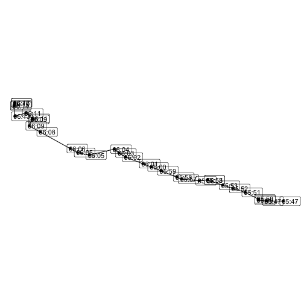

<!--
This file is called .Rmd.orig because it takes forever to run. So instead of having
GH actions render it every time, we pre-render it to archived.Rmd with all R code and
figures created, and re-render it occasionally (precompile.R will do this).
-->


A single GTFS-realtime file is a snapshot of the state of a transit system in time. However, from an analytical perspective it is often more useful to archive GTFS-realtime feeds over time (once every minute is common), and then analyze a whole slew of GTFS-realtime feeds at once.

This vignette discusses how to aggregate multiple vehicle position feeds and get a table of vehicle positions over the course of (e.g.) a full day, and do some basic analysis with it.

## The data

<div class="figure">

<p class="caption">plot of chunk unnamed-chunk-12</p>
</div>

In this vignette, we will work with one day of archived GTFS-realtime position data from the [MTA New York City Transit Bus realtime feed](https://bustime.mta.info/wiki/Developers/Index). These positions over the course of the day are shown above; at the end of this vignette we will see how to make this animation.

This data is too large to include with the `gtfsrealtime` package, so [it is available for download here](https://files.indicatrix.org/gtfsrealtime-r/nyc-bus-demo.zip). The R code below will download and unzip one day of GTFS-realtime vehicle position files, and place it in a directory `nyc-bus-demo` in the current working directory.


``` r
suppressMessages({
  if (!dir.exists("nyc-bus-demo")) {
    zipfile = tempfile(fileext = ".zip")

    download.file(
      "https://files.indicatrix.org/gtfsrealtime-r/nyc-bus-demo.zip",
      zipfile
    )

    unzip(zipfile, exdir=".")
    file.remove(zipfile)
  }
})
```

## Load libraries

Next, we need to load libraries. We use quite a few different libraries in this vignette; not all will be required for every analysis. `ggplot2`, `dplyr`, `lubridate`, and `purrr` are all part of the tidyverse and could alternately be loaded with `library(tidyverse)`.


``` r
library(gtfsrealtime)
library(purrr)
library(data.table)
library(dplyr)
library(tidyr)
library(lubridate)
library(sf)
library(ggplot2)
library(gifski)
```

Next, we read in multiple GTFS-realtime files, and stack them all together. There are 1,440 GTFS-realtime files, from 3:00 AM local time on January 28, 2026 to 2:59 AM local time on January 29. We use the `Sys.glob` function to match multiple files - in this case, every vehicle position file in `nyc-bus-demo`. The `*` means "anything", so this will match any file that starts with `nyc-bus-demo/vehicle-positions-` and ends with `.pb.bz2`. (`.pb.bz2` means a Protocol Buffers file, the underlying format of GTFS-realtime, compressed using `bzip2`. 'gtfsrealtime' can load files compressed with `gzip` or `bzip2` directly). We use the `map` function from 'purrr' to apply a function to each file name, and the `rbindlist` function to stack all of the records into a single `data.table`.

## Read data


``` r
positions = map(
    Sys.glob("nyc-bus-demo/vehicle-positions-*.pb.bz2"),
    read_gtfsrt_positions
  ) |>
  rbindlist()

head(positions)
```

```
##               id latitude longitude  bearing odometer speed                            trip_id route_id direction_id
##           <char>    <num>     <num>    <num>    <num> <num>                             <char>   <char>        <num>
## 1: MTA NYCT_7116 40.67004 -73.84773 343.8108       NA    NA  EN_A6-Weekday-SDon-013500_B15_103      B15            0
## 2: MTA NYCT_8446 40.70428 -73.79269 310.4622       NA    NA   JA_A6-Weekday-SDon-016700_Q5_201       Q5            0
## 3: MTA NYCT_9760 40.74069 -73.99020 234.0276       NA    NA   MV_A6-Weekday-SDon-013000_M2_202       M2            1
## 4: MTA NYCT_7160 40.71404 -73.95068 359.4692       NA    NA         FP_M6-Weekday-017500_L90_5      L90            0
## 5: MTA NYCT_5314 40.81609 -73.91773 341.5651       NA    NA WF_A6-Weekday-SDon-015000_BX19_301     BX19            0
## 6: MTA NYCT_5338 40.86142 -73.89084 329.7436       NA    NA  KB_A6-Weekday-SDon-015500_BX9_601      BX9            1
##    start_time start_date schedule_relationship stop_id current_stop_sequence current_status  timestamp congestion_level
##        <char>     <char>                <fctr>  <char>                 <num>         <fctr>      <num>           <fctr>
## 1:       <NA>   20260128                  <NA>  904253                    NA           <NA> 1769587226             <NA>
## 2:       <NA>   20260128                  <NA>  503967                    NA           <NA> 1769587224             <NA>
## 3:       <NA>   20260128                  <NA>  400330                    NA           <NA> 1769587206             <NA>
## 4:       <NA>   20260128                  <NA>  302319                    NA           <NA> 1769587202             <NA>
## 5:       <NA>   20260128                  <NA>  103748                    NA           <NA> 1769587224             <NA>
## 6:       <NA>   20260128                  <NA>  104102                    NA           <NA> 1769587202             <NA>
##        occupancy_status occupancy_percentage    vehicle_id vehicle_label vehicle_license_plate
##                  <fctr>                <num>        <char>        <char>                <char>
## 1: MANY_SEATS_AVAILABLE                   NA MTA NYCT_7116          <NA>                  <NA>
## 2:                 <NA>                   NA MTA NYCT_8446          <NA>                  <NA>
## 3:                 <NA>                   NA MTA NYCT_9760          <NA>                  <NA>
## 4:                 <NA>                   NA MTA NYCT_7160          <NA>                  <NA>
## 5:                 <NA>                   NA MTA NYCT_5314          <NA>                  <NA>
## 6:                 <NA>                   NA MTA NYCT_5338          <NA>                  <NA>
```

We have read 2.8 million vehicle observations:


``` r
nrow(positions)
```

```
## [1] 2825902
```

## Clean data

Some of the observations are duplicates, as not every bus reports in every minute. We can identify these based on timestamp and vehicle ID, and go down to a single record per report. This uses 'data.table' syntax, which is somewhat more obtuse than 'tidyverse', but orders of magnitude faster - important with large datasets such as this.

The syntax below groups by timestamp and vehicle ID (the last part). It then takes the first row of each SubDataset (`.SD[1]`).

Note that, at least in the New York data, there are sometimes multiple reports with the same timestamp and vehicle ID but different locations. This is some type of data error, so I just pick the first reported position for a given time.


``` r
positions = positions[, .SD[1], by = c("timestamp", "vehicle_id")]
```

The timestamp column is a [Unix timestamp](https://en.wikipedia.org/wiki/Unix_time), measuring seconds since January 1, 1970 at 00:00:00 UTC. We convert it here to a datetime object, and adjust the timezone, since Unix time is always recorded in UTC.


``` r
positions[, timestamp := with_tz(as_datetime(timestamp), "America/New_York")]
```

The data are spatial, so we can convert to an `sf` object for remaining spatial analyses. The data in GTFS realtime is always WGS 84 latitude/longitude, so we specify that the CRS is 4326 when creating the dataset, then immediately project to 32118, State Plane New York Long Island.


``` r
positions = positions |>
  st_as_sf(coords=c("longitude", "latitude"), crs=4326) |>
  st_transform(32118)
```

## Getting a snapshot state at any given time

To get the positions of all vehicles at any given time, we want to grab all position reports within (say) the last five minutes, and get the most recent one for each vehicle. We can write a function to do this:


``` r
snapshot_positions = function (positions, time, tolerance_mins=5) {
  # sf uses tidyverse syntax rather than data.table
  positions |>
    filter(timestamp <= time & timestamp >= time - minutes(tolerance_mins)) |>
    group_by(vehicle_id) |>
    slice_max(timestamp)
}
```

And we can use that function to get all vehicle positions at 8 AM on the day our data were collected:


``` r
# note! important to specify correct time zone
pos_8am = snapshot_positions(positions, ymd_hms("2026-01-28 8:00:00", tz = "America/New_York"))
```

We could plot those positions:


``` r
ggplot(pos_8am) +
  geom_sf() +
  # theme_void removes all plot elements
  theme_void()
```

<div class="figure">

<p class="caption">plot of chunk unnamed-chunk-9</p>
</div>

## Animating positions

Now we get to making the figure we saw at the top. We will render one "frame" (plot of bus locations) for each minute, and then use [gifski](https://cran.r-project.org/web/packages/gifski/index.html) to convert to an animated GIF. First, we will create a temporary directory to hold those frames:


``` r
framedir = tempfile()
dir.create(framedir)
```

Next, we will render the plots to image files in that directory, one at a time. We have data from 3am NYC time 2026-01-28 to 3am 2026-01-29, so we will have 1,440 frames one minute apart.


``` r
# as.list is necessary to preserve column type:
# https://stackoverflow.com/questions/77838146
times = as.list(ymd_hms("2026-01-28 03:00:00", tz="America/New_York") + minutes(0:1440))

# get the bounding box of all positions over the course
# of the day, so that every frame has the same extent
bbox = st_bbox(positions)

for (time in times) {
  current_pos = snapshot_positions(positions, time)
  p = ggplot(current_pos) +
    theme_void() +
    geom_sf(size=0.3) +
    xlim(bbox$xmin, bbox$xmax) +
    ylim(bbox$ymin, bbox$ymax) +
    # add the current time as the title
    ggtitle(format(time, "%B %d, %H:%M"))

  # save the frame, using the Unix timestamp in the filename
  ggsave(
    file.path(framedir, paste0("time", as.numeric(time), ".png")),
    width=6, height=6, dpi=150, bg="white", plot = p)
}
```

Lastly, we render all the frames we created to an animated GIF:


``` r
gifski(
  list.files(framedir, full.names=TRUE),
  "figures/nyc_bus_anim.gif",
  # twenty minutes per second
  delay = 1 / 20,
  # match resolution of input files (6 in by 6 in at 150 dpi)
  width = 900,
  height = 900
)
```

```
## [1] "figures/nyc_bus_anim.gif"
```

``` r
knitr::include_graphics("figures/nyc_bus_anim.gif")
```
<div class="figure">

<p class="caption">plot of chunk unnamed-chunk-12</p>
</div>

And finally, clean up after ourselves by removing the temporary directory.


``` r
unlink(framedir, recursive=TRUE)
```

## Extracting trajectories

We can also extract the trajectories that particular vehicles took over the course of the day. We do this by grouping by vehicle ID (we could also group by trip ID to get single runs), and then summarizing and converting the combined points into a linestring (line feature).

This is quite slow, which seems to be related to the use of `st_cast`; this issue needs further investigation.


``` r
trajectories = positions |>
  arrange(vehicle_id, trip_id, timestamp) |>
  group_by(vehicle_id, trip_id) |>
  summarize(do_union=FALSE) |>
  st_cast("LINESTRING")
```

```
## `summarise()` has grouped output by 'vehicle_id'. You can override using the `.groups` argument.
```

We can then plot all of those trajectories over the course of the day:


``` r
ggplot(trajectories) +
  theme_void() +
  geom_sf()
```

<div class="figure">

<p class="caption">plot of chunk unnamed-chunk-15</p>
</div>

Or extract a single trajectory:


``` r
ggplot(trajectories[2, ]) +
  theme_void() +
  geom_sf()
```

<div class="figure">

<p class="caption">plot of chunk unnamed-chunk-16</p>
</div>

Or extract a single trajectory and combine it with times:


``` r
trajectory = trajectories[2, ]
points = positions |>
  filter(vehicle_id == trajectory$vehicle_id & trip_id == trajectory$trip_id)

ggplot() +
  geom_sf(data=trajectory) +
  geom_sf(data=points) +
  # label the times the bus reached each point
  geom_sf_label(
    data=points,
    aes(label=format(timestamp, "%H:%M")),
    position = position_nudge(x=120)
  ) +
  theme_void()
```

<div class="figure">

<p class="caption">plot of chunk unnamed-chunk-17</p>
</div>
